# 仅用 `meme-template.json` 的 Prompt 编辑与生成对齐

## 结论

**够用。** 前后端只需要共享 `meme-template.json`；不依赖 `image-edit-template.json`。

`meme-template.json` 已经包含完整的运行时信息：

| 字段 | 用途 |
| --- | --- |
| `key` | 模板的稳定 ID；生成请求只传它，不传整份模板 |
| `promptTemplate` | 模板图片的完整文字描述；也是前端编辑器初始文本 |
| `inputSchema` | 可快速替换的 slot，以及上传图控件定义 |
| `referenceImage` | 模板参考图；导入后应为 OSS/CDN URL |
| `metadata.templateSource` | 参考图的构图与风格权限、硬约束 |
| `metadata.inputSemantics` | slot 的身份/语义权限和默认值 |

`cover` 只用于列表展示；生成时使用 `referenceImage`。

## 用户流程

```mermaid
sequenceDiagram
  participant U as 用户
  participant F as 前端
  participant B as 后端
  participant L as LLM 编排层
  participant I as 图像生成服务

  F->>B: 获取 meme-template.json
  B-->>F: 模板详情（含已解析的参考图 URL）
  U->>F: 修改 prompt 或点击 slot 快捷替换
  F->>B: templateKey、userPrompt、slotValues、可选主体图
  B->>B: 按 templateKey 重新读取可信模板
  B->>L: 用户意图 + promptTemplate + 硬约束
  L-->>B: finalPrompt + preservedConstraints
  B->>I: finalPrompt + referenceImage + 可选主体图
  I-->>B: 生成图片
  B-->>F: 图片、任务状态
```



## 前端：从 `promptTemplate` 渲染编辑器

### 1. 解析 slot

`promptTemplate` 使用受限占位符语法：

```text
{{ subject | "棕白短毛狗" }}
```

前端解析规则：

1. `subject` 必须能在 `inputSchema[].id` 中找到。
2. `"棕白短毛狗"` 是 slot 的显示默认值；也可优先使用 `metadata.inputSemantics.subject.defaultValue`。
3. 将该片段渲染为可点击的 slot chip，例如 `【主体：棕白短毛狗】`。
4. 用户从建议项选择“橘猫”时，更新 `slotValues.subject`，并将编辑器的对应文本替换为“橘猫”。
5. 用户可以直接编辑整段文字；编辑器不需要也不应该改写原始模板硬约束。

`inputSchema` 中的 `type: "prompt"` 渲染为文本/建议项；`type: "image"` 渲染为上传控件。这个模板的 `subject_reference` 是可选身份参考图。

### 2. 编辑器状态

```ts
type PromptEditorState = {
  templateKey: string;
  userPrompt: string; // 用户当前看到并编辑的全文
  slotValues: Record<string, string>;
  subjectReferenceAssetId?: string;
};
```

首次进入时：

- `userPrompt`：把 `promptTemplate` 的占位符替换为默认值后的文本；
- `slotValues`：从 `metadata.inputSemantics` 的默认值建立；
- 用户每次直接改全文，只更新 `userPrompt`；
- 用户通过 chip 改 slot，则同时更新 `slotValues` 和 `userPrompt`。

`slotValues` 仅用于快捷编辑、回显和给 LLM 的结构化提示；**`userPrompt` 是用户最终意图的唯一文本来源**。两者不一致时，后端以 `userPrompt` 为主。

## 前端到后端的生成请求

建议端点：`POST /api/template-generations`

```ts
type CreateTemplateGenerationRequest = {
  templateKey: string;
  userPrompt: string;
  slotValues: Record<string, string>;
  subjectReferenceAssetId?: string;
};
```

前端只传 `templateKey`，不要传 `referenceImage`、`lockedConstraints` 或完整 `meme-template.json`，避免用户篡改模板权限和硬约束。上传图先通过资产 API 获得 `subjectReferenceAssetId`。

## 后端生成流程

1. 使用 `templateKey` 从数据库读取**可信的** `meme-template.json` 记录。
2. 校验 `slotValues` 的 key 必须属于 `inputSchema`；校验 `subjectReferenceAssetId` 属于当前用户且类型符合 `image` 输入。
3. 将 `promptTemplate`、`metadata.templateSource.lockedConstraints`、`metadata.templateSource.preserve`、`metadata.inputSemantics` 和用户提交的 `userPrompt` 传给 LLM 编排层。
4. LLM 输出 `finalPrompt`；后端验证其 `preservedConstraints` 覆盖所有硬约束。
5. 调用图像生成服务：
   - `referenceImage`：模板图，拥有构图与风格权威；
   - `subjectReferenceAssetId` 对应图片（可选）：仅拥有身份权威；
   - `finalPrompt`：已合成的文字指令。
6. 保存模板版本、`userPrompt`、`finalPrompt`、图片资产 ID、模型参数和生成结果，支持复现与审计。

## LLM 编排契约

LLM 的工作是合并，不是重做模板。它必须：

- 把 `userPrompt` 视为用户想改什么；
- 以 `promptTemplate` 补足完整模板语境；
- 无条件保留 `lockedConstraints`；
- 将用户主体图限制为身份参考，不能把它当作构图参考；
- 返回严格 JSON。

期望输出：

```json
{
  "normalizedPrompt": "将主体替换为一只神情淡定的橘猫，保留名画戏仿肖像。",
  "finalPrompt": "实际发给图像模型的完整指令",
  "preservedConstraints": ["每条硬约束"],
  "warnings": []
}
```

若 `preservedConstraints` 没有覆盖模板的全部 `lockedConstraints`，后端必须拒绝该结果并重试，或使用后端兜底拼接，不可直接生成。

## 图片权限

| 图片 | 来源 | 可以影响 | 不可以影响 |
| --- | --- | --- | --- |
| `referenceImage` | 模板 | 构图、回眸姿势、竖幅裁切、头巾、耳环、光线、背景节奏 | 用户主体身份 |
| `subjectReferenceAssetId` | 用户，可选 | 品种、毛色、轮廓、耳形、表情 | 镜头、姿势、排布、模板风格 |

## 资产 URL 约定

本地模板文件里的 `referenceImage: "./source.png"` 只适用于导入前。导入服务上传模板图后，数据库/API 返回给前端和生成服务的模板记录必须将 `referenceImage` 解析为受控的 OSS/CDN URL。不要让浏览器或生成服务解析本地相对路径。

## 错误码

- `TEMPLATE_NOT_FOUND`：模板不存在或不可用。
- `INVALID_SLOT_VALUE`：slot 不属于该模板或值不合法。
- `INVALID_USER_PROMPT`：`userPrompt` 为空或超长。
- `ASSET_FORBIDDEN`：用户无权使用上传资产。
- `PROMPT_COMPOSITION_FAILED`：LLM 输出缺失硬约束或无法解析。
- `IMAGE_GENERATION_FAILED`：图像服务生成失败。
