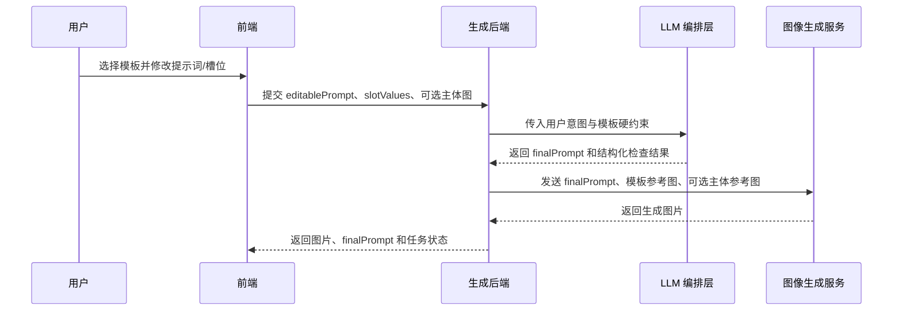

# 模板 Prompt 编辑与生成接口对齐

## 目标

用户先选择模板，在前端编辑模板描述和槽位值；后端使用 LLM 将用户意图与模板硬约束合并为最终生图指令，再将最终指令和参考图片发送给图像生成服务。

`image-edit-template.json` 是前端编辑配置的来源；`meme-template.json` 用于模板后台入库和服务端兜底编译。前端不要直接把 `promptTemplate` 当成可编辑器内容。

## 数据与职责

| 数据 | 生产方 | 消费方 | 职责 |
| --- | --- | --- | --- |
| `image-edit-template.json` | 模板作者/后台 | 前端、生成 API | 编辑器初始文案、槽位、模板约束与图片权限 |
| `templateText` | 模板 | 前端 | 含 `【槽位：默认值】` 的可视化快捷编辑稿 |
| `editablePrompt` | 模板/用户 | 前端、LLM 编排层 | 用户可以自由修改的整段自然语言提示词 |
| `slots` / `slotValues` | 模板/用户 | 前端、LLM 编排层 | 快速替换的结构化值；便于校验、回显和分析 |
| `referenceImage` | 模板后台 | 图像生成服务 | 固定构图、镜头、风格与文化识别锚点 |
| `subjectReference` | 用户 | 图像生成服务 | 可选，仅提供主体身份线索，不得覆盖模板构图 |
| `finalPrompt` | LLM 编排层 | 图像生成服务 | 已合并用户意图与模板硬约束的最终文本指令 |

## 端到端流程



## 前端实现

1. 请求模板详情，加载 `image-edit-template.json` 等价的 API 数据。
2. 用 `templateText` 渲染“快捷替换”的可视化 token；点击 token 后按对应 `slot.id` 更新值。
3. 同步更新 `editablePrompt`，但允许用户直接编辑整段文本。
4. 用户点击生成时，提交：
   - `templateKey`
   - `editablePrompt`：以用户最后编辑版本为准
   - `slotValues`：用于快速替换回显和后端校验
   - `subjectReferenceAssetId`：可选，先上传后得到 asset id
5. 前端不负责把模板约束拼到 prompt，也不将本地 `source.png` 路径传给浏览器；后端根据 `templateKey` 查询模板资产 URL 和锁定约束。

### 编辑冲突规则

- 用户直接编辑了 `editablePrompt` 后，仍保留 `slotValues` 供 UI 回显；不要用槽位值覆盖用户整段文本。
- 当用户通过槽位编辑时，可只替换 prompt 中对应的当前 token/默认值；找不到可安全替换的位置时，更新 `slotValues`，并提示用户检查整段 prompt。
- 前端可提示锁定项，但不要隐藏或禁止用户整段编辑；最终由 LLM 编排层恢复模板的硬约束。

## 生成 API 合约

建议端点：`POST /api/template-generations`

请求 schema：

```ts
type CreateTemplateGenerationRequest = {
  templateKey: string;
  editablePrompt: string;
  slotValues: Record<string, string>;
  subjectReferenceAssetId?: string;
};
```

成功响应：

```ts
type CreateTemplateGenerationResponse = {
  generationId: string;
  status: "queued" | "processing" | "succeeded" | "failed";
  normalizedPrompt?: string;
  finalPrompt?: string;
  imageUrls?: string[];
  error?: {
    code: string;
    message: string;
  };
};
```

`normalizedPrompt` 是 LLM 整理后的用户意图摘要，`finalPrompt` 是实际传给图像模型的完整指令。生产环境建议仅在鉴权用户可见的任务详情接口中返回 `finalPrompt`。

## 后端编排流程

1. 按 `templateKey` 读取已入库的 `meme-template.json` 等价模板记录。
2. 校验 `editablePrompt` 长度、`slotValues` 的 key 是否属于模板、上传资产是否属于当前用户。
3. 读取模板硬约束：`metadata.templateSource.preserve` 和 `lockedConstraints`。
4. 调用 LLM 编排层，输入用户 prompt、slot 值、模板的锁定构图和图片权限。
5. 校验 LLM 返回：不得遗漏任一硬约束，不得将用户主体图提升为构图参考。
6. 调用图像生成服务：
   - 模板 `referenceImage`：构图与风格参考；
   - 可选用户主体图：身份参考；
   - `finalPrompt`：最终文字指令。
7. 记录 `normalizedPrompt`、`finalPrompt`、模板版本、生成参数和结果 URL，便于复现和排障。

## LLM 编排输入与输出

LLM 不负责自由创作模板，而是把用户编辑意图安全地合入模板。它必须：

- 保留模板硬约束；
- 将用户输入视为主体/语义修改，不改变模板构图；
- 处理用户 prompt 与 slot 值不一致时，以用户 `editablePrompt` 为主，并把 slot 值作为补充上下文；
- 产出 JSON，便于后端解析与校验。

建议 LLM 输出：

```json
{
  "normalizedPrompt": "将主体替换为橘猫，保留名画戏仿肖像特征。",
  "finalPrompt": "...",
  "preservedConstraints": ["..."],
  "warnings": []
}
```

若 `preservedConstraints` 与模板硬约束不完全覆盖，后端应拒绝该 LLM 输出、自动重试，或进入后端兜底拼接逻辑。

## 图片参考权限

| 图片 | 权限 | 允许影响 | 不允许影响 |
| --- | --- | --- | --- |
| 模板 `referenceImage` | 构图与风格 | 回眸姿势、竖幅裁切、头巾、耳环、光线、背景节奏 | 用户主体身份 |
| 用户 `subjectReference` | 身份 | 品种、毛色、轮廓、耳形、表情 | 镜头、姿势、排布、模板图风格 |

## 错误处理与审计

- 未找到模板：`TEMPLATE_NOT_FOUND`
- slot 不属于模板：`INVALID_SLOT_VALUE`
- prompt 为空或超长：`INVALID_EDITABLE_PROMPT`
- 用户上传资产无权限：`ASSET_FORBIDDEN`
- LLM 输出不满足硬约束：`PROMPT_COMPOSITION_FAILED`
- 图像服务失败：`IMAGE_GENERATION_FAILED`

不要把 LLM 或图像服务的原始错误直接暴露给用户；在服务端保存关联 id 和原始响应以便排障。
